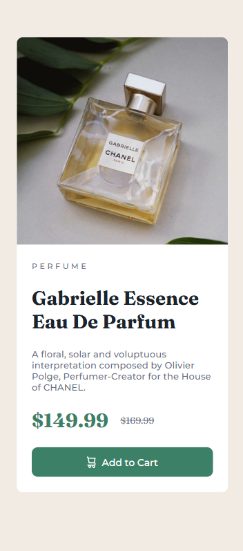

# Frontend Mentor -  Solução para componente de cartão de pré-visualização de produto 

## Descrição
Este projeto apresenta um cartão de pré-visualização de produto desenvolvido como desafio do Frontend Mentor, utilizando HTML e CSS puro, onde os usuários podem visualizar o layout adaptado de acordo com o tamanho da tela do dispositivo. A interface também possui um botão interativo.

## Prévia do Design para Mobile


## Prévia do Design para Desktop


## Conceitos Praticados
- Estrutura semântica com HTML5
- CSS
- Layout responsivo
- Flexbox
- Mobile First
- Pseudo classes (`:hover`)
- Media Queries
- Variáveis CSS (`:root`)

## Pré-requisitos
Você precisa ter:
- Um navegador atualizado
- Um editor de código como o Visual Studio Code

## Como executar o projeto
### Opção 1 - Baixar o projeto
1. Baixe o arquivo `.zip`
2. Extraia a pasta 
3. Abra o `index.html` no navegador

### Opção 2 - Clonar com o git
#### Pré-requisito
- Git instalado

1. No terminal clone o projeto da seguinte forma:
```bash
git clone https://github.com/luara-hildebrand08/desafio2-frontend-mentor.git
```

##  📂 Estrutura do projeto

```txt
 📂 desafio2-frontend-mentor
  ├── 📁 images
  |    ├── image-product-mobile.jpg
  |    ├── image-product-desktop.jpg
  |    └── icon-cart.svg
  ├── index.html
  ├── style.css
  └── README.md
  ```

## Autora
Feito por Luara de Lana Lima Hildebrand